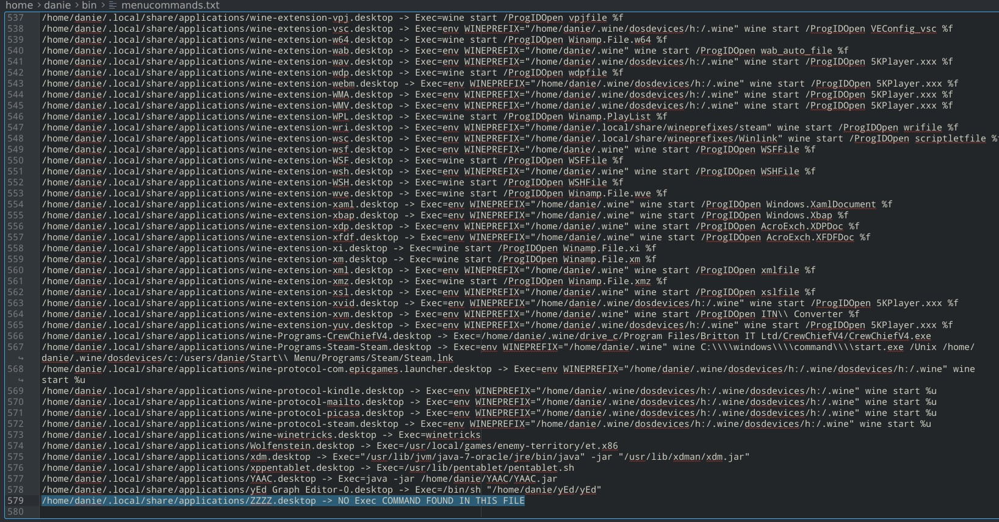
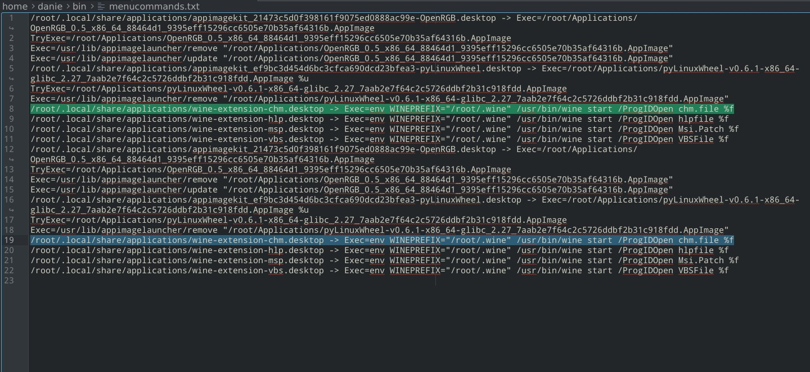

# linux-menu-filecheck
Bash script to check whether user's Linux menu desktop files contain a valid Exec line

## Background
The problem I was trying to solve, was having numerous dead menu entrie son my Linux system. I was looking for some way to identify, out of the 200 or 300 menu entries, which ones are possibly redundant, and could be removed.

This was actually not as easy as it sounds, as I thought I could just parse the files, and then test whether the executable exists or not, and flag it accordingly. But it turns out plenty of commands are not just actual commands being executed, and it includes more complex Java calls, Wine environment calls, etc.

So in the end, and for now, I have parsed the files to check whether they have an Exec line, and then it prints out the file name with the Exec line, for manual scanning and elimination. I have fully commented what each line is achieving inside the code.

I'm open to other possibilities though to achieve the primary aim!

## Instructions
This is a bash shell script so just the cleanmenu.sh script file needs to be downloaded and given executable permissions. You can then run it with ./cleanmenu.sh if you are in the directory where you downloaded it.

It needs to be executed from the CLI console, and it will create its output file in the same directory it is run from, in a file named 'menucommands.txt'. It always appends to that same file, so if you want to start a fresh run, just delete that output file first.

Note you can run it as a normal user, or as the root user with sudo pre-pended. For both it will scan the *.desktop files in the '~/.local/share/applications' directory. These are where the user's application menu desktop files are located (Root user's files under Root's home directory which is /root). The 'Exec=command' must be present in these files for a menu entry to actually execute an application. So, instead of opening every individual file and checking for that line, this script does that for you, and creates an output file for you to visually scan, and which you can use as a checklist to start eliminating orphaned menu entries. By deleting a desktop file, it will disappear from your Linux menu (so you may want to backup this directory first, if you don't like living on the edge!).

Note also that if this script is run as the sudo (root) user, the output file will also have root permissions. This means that you need root permission to delete it, and also if you run the script afterwards as a normal user, it will give an error as it cannot overwrite that root permissions output file if it still exists.

## Interpreting Outputs
The output file is named 'menucommands.txt' and will be located in the current directory where you executed the script.

Each line will contain the full path and filename followed by the Exec=command that is associated with that file (see screenshots below). If the desktop file exists, but no Exec=command was found in it, the path and filename will be followed by a message stating 'NO Exec COMMAND FOUND IN THIS FILE'. I have not tested for 'no command' following 'Exec=' as that would be self-evident from the output generated.

If the desktop file is in the users location for menu desktop files, but it has root permission there, nothing will be inside the output file created, but you will see a grep error message on the CLI command console listing the path and filename, followed by 'No such file or directory'.

## Screenshots

## Credits
Well thanks to Google Bard actually as I used its AI to show some code for how to open file with spaces in their names, as well as how to concatenate the output strings, and to determine the boolean value of the grep result. Google Bard showed relevant code snippets that I could adapt and use.
